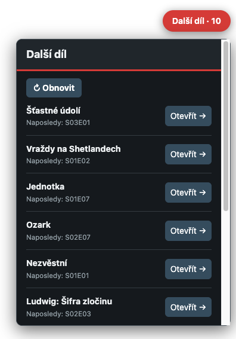

# Další díl

Další díl keeps the next episode of every series you rate on ČSFD one click away.

Další díl is an independent, custom extension. It is not an official ČSFD extension and
is not affiliated with or endorsed by ČSFD.

## Install

1. Download or clone this repository.
2. Open `chrome://extensions` in Chrome.
3. Turn on **Developer mode**.
4. Choose **Load unpacked** and select this folder.
5. Pin **Další díl** to the toolbar.

## Get started

Sign in to ČSFD normally, then open Další díl. It identifies the signed-in account and begins reading your episode ratings. If automatic detection is unavailable, open **Nastavení** and paste the address of your ČSFD profile, such as `https://www.csfd.cz/uzivatel/123-name/`.

The first scan can take several short passes when your ratings history is long. You can close the popup while it works; progress is saved.

Each row shows the last normally numbered episode you rated and links directly to the following episode. The most recently active series appear first, and finished series are left out.

## Use it on ČSFD

On ČSFD pages, select **Další díl** in the upper-right corner to open your saved list. After rating an episode, choose **↻ Obnovit** in the panel to pick up the new vote. The toolbar popup remains available on every page.

Open **Nastavení** to:

- show between 1 and 25 series;
- choose Czech, Slovak, or English—the default is Czech;
- run **Načíst vše znovu** after removing old ratings or when you want to rebuild all progress.

If ČSFD asks for a browser check, complete it in a normal ČSFD tab and refresh Další díl again. Saved results remain visible while a refresh is unavailable.

## What it touches

Další díl contacts only `www.csfd.cz` and `www.csfd.sk`. It reads the signed-in header, profile-rating pages, and episode pages through your normal browser session. It never receives or stores your ČSFD password or cookies, and it never changes ratings or other ČSFD data.

Derived progress, language and display settings, and cached links stay in Chrome's local extension storage. There is no analytics service, separate account, API key, or Další díl server.

## Limits

- A rating is treated as evidence of progress; unrated watched episodes cannot be inferred.
- When episode numbering is available, rating an older episode later makes the series recent without moving established progress backward. When ČSFD omits episode numbers, an unusual vote order can initially choose the wrong current episode.
- Removed ratings are reconciled by **Načíst vše znovu**, not necessarily by the next short refresh.
- Specials without normal season and episode numbering follow ČSFD's own navigation where possible.
- A major ČSFD markup change or browser check can temporarily stop a refresh. Cached results remain available.

## Licence

[MIT](LICENSE)
